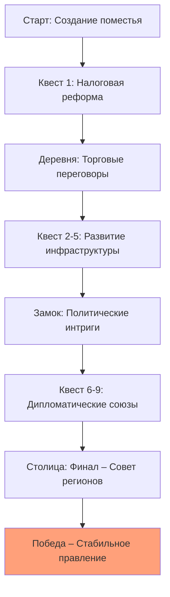

# Техническое задание на разработку игры

**Жанр:** Симулятор  
**Сеттинг:** Средневековье  
**Фишка:** Система репутации (влияние на взаимодействие с фракциями, доступ к ресурсам и квестам)  

**Название игры:** Властелин Земель  

**Заказчик:** newlxp.ru  

**Разработчик:** Черков Мирон  

**Версия ТЗ:** 1.0  
**Дата:** 04 декабря 2025 г.  

## 1. Введение

Игра "Властелин Земель" — это браузерный пошаговый симулятор управления средневековым поместьем. Игрок выступает в роли управляющего землями, который развивает хозяйство, взаимодействует с соседями, решает конфликты и участвует в политике региона. Ключевая фишка — система репутации: каждое решение игрока влияет на отношение различных фракций (крестьяне, дворяне, церковь, купцы), что открывает или закрывает доступ к ресурсам, квестам и союзникам.  

Целевая аудитория: игроки 12–16 лет, интересующиеся историей, стратегиями и симуляторами.  
Ожидаемая продолжительность прохождения: 3–5 часов.  
Платформа: веб-браузер (Chrome, Firefox, Safari последней версии).  

## 2. Цели и задачи

**Цель:** Создать увлекательный симулятор, где успех игрока напрямую зависит от его репутации среди фракций, мотивируя к стратегическому планированию и дипломатии.  

**Задачи:**  
- Реализовать систему управления поместьем с 4 типами ресурсов (еда, золото, древесина, железо) и 3 типами построек.  
- Создать 5 регионов с 10 основными квестами и нелинейными побочными ветками.  
- Интегрировать систему репутации: 4 фракции с уровнями отношения от -100 до +100.  
- Обеспечить пошаговую систему принятия решений (дипломатия, торговля, конфликты).  
- Реализовать сохранение прогресса и таблицу лидеров по накопленному богатству и репутации.  

## 3. Требования к функционалу

### 3.1. Система управления поместьем
- Создание поместья: выбор названия, начального региона, распределение 100 единиц ресурсов.  
- Развитие: строительство зданий (ферма, лесопилка, кузница, церковь), наём работников.  
- Ресурсы: ежедневный доход/расход, влияние событий и репутации.  

**Таблица ресурсов и влияния:**

| Ресурс    | Влияние                          | Формула дохода           |
|-----------|----------------------------------|--------------------------|
| Еда       | Довольство населения, рост       | Еда = фермы × 10 - население × 2 |
| Золото    | Торговля, наём, строительство    | Золото = торговля × (1 + репутация купцов/100) |
| Древесина | Строительство, улучшения         | Древесина = лесопилки × 5        |
| Железо    | Оружие, укрепления               | Железо = кузницы × 3             |

### 3.2. Мир и квесты
- 5 регионов: Поместье (хаб), Деревня (торговля), Лес (ресурсы), Замок (политика), Столица (финал).  
- 10 основных квестов (линейная цепочка) + 5 побочных (опционально, +репутация).  
- Пример квеста "Налоговая реформа": поговорить с советником → собрать мнения фракций → принять решение → изменить репутацию.  

**Пример сценария квеста (user story):**  
*Как управляющий, я хочу провести переговоры с купцами, чтобы получить скидку на товары.*  
1. NPC: "Купеческая гильдия требует снижения налогов на 20%. Согласитесь?" (Варианты: Да/Нет/Торг).  
2. Решение влияет на репутацию с купцами и казну.  

### 3.3. Система репутации
- 4 фракции: Крестьяне, Дворяне, Церковь, Купцы.  
- Уровень репутации от -100 (вражда) до +100 (союз).  
- Влияние на игровой процесс: доступ к уникальным квестам, ценам, поддержке в конфликтах.  

### 3.4. Дипломатия и события
- Случайные события (неурожай, набеги, эпидемии).  
- Дипломатические решения: переговоры, подарки, угрозы.  
- Влияние репутации на исход событий.  

### 3.5. Экономика и торговля
- Динамические цены на рынке (зависит от региона, репутации, событий).  
- Возможность инвестиций, кредитов, спекуляций.  

## 4. Требования к интерфейсу

- Вид: 2D top-down (800×600 px, responsive до 1920×1080).  
- HUD: Бары ресурсов, уровень репутации по фракциям, мини-карта, кнопки управления.  
- Диалоги: всплывающее окно с текстом, 3–5 выборов (влияют на репутацию).  
- События: модальное окно с описанием и вариантами действий.  

**Пример UI HUD (ASCII-мокап):**

```markdown
[Золото: 500] [Еда: 200] [Древесина: 150] [Железо: 80]
[Крестьяне: ████░░ 60] [Дворяне: ██░░░░ 30] [Церковь: █████ 90] [Купцы: █░░░░░ 10]
[Карта] [Сохранить] [Пауза]
```

- Шрифты: исторический стиль (Google Fonts: "MedievalSharp" для текста).  
- Анимации: плавное изменение значений ресурсов, всплывающие уведомления.  

## 5. Нефункциональные требования

- Производительность: 60 FPS на средних ПК (i5, 8GB RAM), загрузка регионов <2 сек.  
- Доступность: управление мышью и клавиатурой (Tab, Enter), контраст цветов >4.5:1.  
- Локализация: русский (текст, названия), английские термины в экономике.  
- Безопасность: валидация данных на клиенте, защита от манипуляций с сохранениями.  

## 6. Интеграции и окружение

- Хранение: localStorage (JSON сохранения, 1MB).  
- Лидерборд: отправка итоговых показателей (богатство, репутация) на Firebase Realtime DB.  
- Звуки: Web Audio API, 10 SFX (события, интерфейс) + 3 BGM (атмосферные).  
- Развертывание: GitHub Pages или Vercel.  

## 7. Ограничения и допущения

- Нет мультиплеера или онлайн-сохранений (только local).  
- События: 15 типов, алгоритм случайных с учётом репутации.  
- Графика: спрайты PNG 64×64 px (25 уникальных).  
- Допущение: игнорировать мобильные устройства (<768px — предупреждение).  
- Бюджет: 0 руб., open-source ассеты (OpenGameArt, исторические референсы).  

## 8. Критерии приёмки

- Поместье создаётся и развивается (тест: 10 игровых дней).  
- Все 10 квестов проходятся, 5 побочных работают.  
- Система репутации корректно влияет на игровой процесс (тест: 5 решений).  
- События: 20 симуляций, баланс (игрок не разоряется за 5 дней).  
- Сохранение/загрузка: 100% восстановление прогресса.  
- Лидерборд: запись/чтение 5 записей.  
- Производительность: FPS >50 при активных событиях.  
- Документация: README с управлением.  

Приёмка после демо на GitHub (pull request).

## 9. Приложения

### 9.1. Диаграмма прогресса (Mermaid flowchart)



### 9.2. Структура данных (JSON примера сохранения)

```json
{
  "estate": {
    "name": "Вестфолд",
    "resources": {"gold": 500, "food": 200, "wood": 150, "iron": 80},
    "buildings": ["Ферма", "Лесопилка"],
    "workers": 10
  },
  "reputation": {"peasants": 60, "nobles": 30, "church": 90, "merchants": 10},
  "quests": {"main1": "completed", "side2": "active"},
  "leaderboard_score": 8500
}
```

### 9.3. Таблица влияния репутации

| Фракция   | Влияние при высокой репутации (+)          | Влияние при низкой репутации (-)       |
|-----------|--------------------------------------------|----------------------------------------|
| Крестьяне | +урожай, +лояльность, -бунты               | -производство, +побеги, +бунты         |
| Дворяне   | +военная поддержка, +доступ к землям       | -налоги, +заговоры, -доступ к ресурсам|
| Церковь   | +мораль, +образование, +лечение            | -доверие, +ереси, -стабильность       |
| Купцы     | +торговые скидки, +кредиты, +новые товары  | -доступ к рынку, +конкуренция, -доходы|
